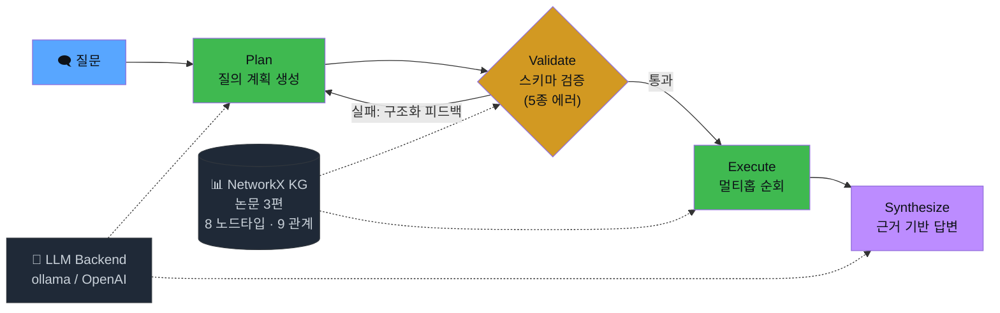

# Self-Correcting GraphRAG Agent

LLM이 생성한 그래프 질의는 틀릴 수 있다 — 없는 관계를 참조하거나, 방향이 반대거나, 존재하지 않는 엔티티를 anchor로 잡거나.
이 프로젝트는 그 틀린 질의를 결정론적으로 잡아내고, 구조화된 피드백으로 LLM이 스스로 고치게 만드는 자가수정 루프를 구현한다.

내 게재 논문 *Improving SQL Generation with Structured EXPLAIN Feedback Using a 4B SLM*에서
SQL에 적용했던 자가수정 메커니즘을 지식그래프로 이식하고, base SLM(qwen2.5-coder:7b) 위에서 어디까지 되고 어디서 무너지는지를 측정했다.

### 기술 스택

| 영역 | 선택 | 이유 |
|---|---|---|
| 에이전트 오케스트레이션 | **LangGraph** | 조건부 분기·자가수정 루프·상태 관리. 프로덕션 표준 |
| 지식그래프 | **NetworkX** | 설치 없이 시작, 스키마 검증 로직에 집중 |
| LLM | **ollama + qwen2.5-coder:7b** | 로컬 실행. 민감 데이터(산업 전력 데이터)가 외부로 나가지 않는 on-premise 환경을 전제 |
| LLM 대체 | **OpenAI API** | 환경변수 하나로 전환 가능한 교체형 설계 |
| 평가 | **결정론 채점** | LLM judge 없이 그래프에서 정답 집합을 도출해 채점 |
| 관측 | **LangSmith** | 환경변수 1개로 단계별 자동 트레이싱 |

## 배경

GraphRAG가 만능은 아니다. 단일홉 조회는 일반 RAG로 충분하고, 관계를 두 번 이상 타야 하는 멀티홉 질문에서만 그래프가 의미를 가진다.
그래서 지식그래프는 내 논문 3편의 교차관계(공유 저자, 공유 데이터 원천, 공유 개념)로 구성했다 — 멀티홉이 실제로 성립하는 구조를 만들기 위해서.

지식그래프를 이루는 논문 3편(데모 질문에 나오는 P1/P2/P3):

| | 주제 | 메모 |
|---|---|---|
| **P1** | 청년 고립 탐지 (HA-XGB) | LSTM-AE · XGBoost · Shannon 엔트로피 |
| **P2** | 산업 전력 이상탐지 (업종 조건화) | KEPCO-AD 데이터셋 사용 |
| **P3** | SQL 생성 + EXPLAIN 자가수정 (4B SLM) | 이 프로젝트가 이식한 자가수정 메커니즘의 원천 논문 |

논문에 사용한 데이터는 대학원 과제로 다룬 KEPCO 산업 전력 데이터로, 비공개 데이터다.
LLM을 로컬 SLM(ollama)으로 돌리는 건 단순한 비용 절감이 아니라,
민감 데이터가 외부 API로 나가지 않는 on-premise 환경을 전제한 설계 결정이다.
이 프레이밍은 KDD 2026 Workshop 논문에서도 동일하게 적용했다.

핵심 질문은 두 가지였다:
- 틀린 그래프 질의를 결정론적으로 잡을 수 있는가?
- 구조화 피드백을 주면 LLM이 실제로 고치는가, 그리고 그 한계는 어디인가?

## 구조



LangGraph `StateGraph`로 네 단계를 연결한다.

- **plan** — LLM이 자연어 질문에서 `{find, relation, anchor}` 형태의 질의 계획을 생성
- **validate** — 스키마(노드타입, 관계, 엔티티)를 결정론적으로 검사. 5종 에러(없는 노드타입 / 없는 관계 / 호환불가 / 없는 anchor / 방향오류)를 잡아내고, 유효한 대안을 피드백으로 돌려준다. 논문에서 EXPLAIN 실행 결과를 피드백으로 쓴 것과 같은 역할
- **execute** — 검증 통과한 계획으로 방향 인식 멀티홉 순회, 근거 서브그래프 수집
- **synthesize** — 수집된 근거로 답변 생성

검증은 스키마만 본다. 교정은 LLM이 한다 — 이 분리가 핵심 설계 결정이다.

## 데모

### 대화형 모드

```bash
python run.py --interactive
```

질문을 직접 입력하면, 매 질문마다 plan → validate → execute → synthesize 네 단계가
trace로 펼쳐진다. 미리 정해진 답을 뱉는 게 아니라 계획하고 검증하는 과정이 그대로 보인다.

<!-- 📷 스크린샷 자리: python run.py --interactive 실행 화면 -->

### 자가수정 회복 (방향오류 → 피드백 → 교정)

```bash
python run.py --demo
```

의도적으로 방향이 틀린 plan을 주입하면, validate가 `E5_wrong_direction` 에러를 잡아내고
유효 대안(`dir을 'in'로 변경`)을 피드백으로 돌려준다.
LLM이 이 피드백을 받아 plan을 재생성하고, 2번째 시도에 통과한다.

<!-- 📷 스크린샷 자리: --demo 의 자가수정 회복 케이스([자가수정 회복] KEPCO-AD ...) -->

### 함정 질문 거부 (존재하지 않는 관계)

"P1을 인용한 내 다른 논문은?" — 내 논문 간 `cites` 관계가 KG에 없다.
validate가 매 시도마다 거부하고, 5회 소진 후 미해결로 종료한다.

<!-- 📷 스크린샷 자리: --demo 의 함정 T2 케이스([함정 T2 · 미해결 기대] ...) -->


## 결과

20문항(정상 15 + 함정 5) × 20회 반복, 결정론 채점. 채점에 LLM judge를 쓰지 않았다.

### 단일홉 vs 멀티홉

단일홉 6문항 중 5개는 거의 100% 정답. 멀티홉은 문항별로 거의 전부 맞거나 전부 틀리는 all-or-nothing 패턴이 나타났다.
group 평균(예: "2hop 50%")은 100% 문항과 0% 문항을 섞은 착시다.

### valid ≠ correct (13.3%)

가장 흥미로운 발견. 답은 맞았는데 경로가 틀린 케이스가 300런 중 40건(13.3%) 나왔다.
예를 들어 "이상금이 쓴 논문의 방법은?" 같은 질문에서 LLM이 anchor를 손병훈으로 잘못 잡는데,
두 사람이 같은 논문을 공저했으므로 답이 우연히 일치한다.

이건 논문에서 말한 FCR(구문 유효성) ≠ 의미적 정답을 그래프 도메인에서 정량화한 것이다.
검증을 통과하고 답까지 맞아도 추론 경로가 틀릴 수 있다.

### 함정 질문 처리

validate가 타입 오류는 즉시 거부한다. 다만 BERT, citation count 같은 함정은
LLM이 스키마에 유효한 형태로 재해석해서 우회하기도 한다.
검증기의 설계상 경계(스키마만 본다)이므로 막지 않고 우회율을 그대로 보고했다.

### 피드백 세부도 실험 (A/B/C)

논문에서는 파인튜닝된 4B 모델로 피드백이 세부적일수록 수렴이 빨라지는 걸 보였다.
base SLM에서 같은 실험을 해보니: 쉬운 교정은 세부도에 관계없이 다 회복하고,
진짜 어려운 멀티홉은 세부도에 관계없이 다 무너진다.

논문 결론의 전제조건을 발견한 셈이다 —
피드백 구조의 이득은 모델이 그 태스크를 해낼 능력이 있을 때만 발현된다. 없으면 무효. 그 경계가 파인튜닝이다.

### 멀티홉 자율계획 (M4)

엔진에 경로를 직접 주입하면 결정론적으로 정답을 낸다. 하지만 base 모델이 자율적으로 4-hop 계획을 세워서
정답에 도달한 건 0/11(qwen2.5-coder:7b, qwen2.5:7b-instruct, qwen3.6:35b 모두 실패).
구조화 다단계 계획에는 태스크 특화 파인튜닝이 필요하다는 결론.

## 한계

- base SLM의 멀티홉 능력에 절벽이 있다. 이건 에이전트 성능을 자랑하는 게 아니라 한계를 측정한 것이다.
- 논문의 파인튜닝 모델은 SQL 태스크 특화라 KG 계획 측정에는 부적합하다. 깨끗한 비교에는 KG 특화 LoRA가 필요하다.
- KG가 작고, valid≠correct 수치는 저자 집합의 구조에 의존한다.
- 20문항 × N=20은 정성적 경향까지만. 통계적 유의성은 더 큰 평가셋의 몫이다.

## 관측

`LANGCHAIN_TRACING_V2=true`와 API 키만 설정하면 LangGraph가 각 단계를 자동 트레이싱한다.
자가수정 케이스에서 초기 plan(`anchor: KEPCO`)과 재생성 plan(`anchor: KEPCO-AD, dir: in`)의 값이 실제로 달라지는 걸
trace로 직접 확인할 수 있다 — 교정을 결정론적 repair 함수가 아니라 LLM이 재계획으로 수행함을 보여준다.

## 실행

### 필요한 것
- Python 3.10+
- [ollama](https://ollama.com/) + `qwen2.5-coder:7b` 모델 (`ollama pull qwen2.5-coder:7b`)
- 또는 OpenAI API 키 (`LLM_BACKEND=openai`, `LLM_MODEL=gpt-4o` 등으로 전환)

### 설치 & 실행

```bash
python -m venv .venv

# Windows
.venv\Scripts\pip install -r requirements.txt

# Linux/Mac
.venv/bin/pip install -r requirements.txt
```

```bash
python run.py                # 질문 하나 end-to-end
python run.py --demo         # 자가수정 회복 + 함정 거부 시연
python run.py --interactive  # 대화형 모드 (직접 질문 입력)
python run.py --m4           # 멀티홉 엔진 증명 + base SLM 한계
python run.py --abc          # 피드백 세부도 A/B/C 실험
python eval/run_eval.py 20   # 평가셋 전체 (N=20)
```

## 파일 구조

```
run.py              CLI 진입점 (데모, 대화형, 실험 모드)
agent.py            LangGraph 자가수정 루프
knowledge_graph.py  KG 검증 + 멀티홉 실행
kg_data.py          논문 3편 기반 KG 온톨로지·데이터
planner.py          자연어 → 질의 계획 (LLM + 폴백)
synthesize.py       서브그래프 근거 기반 답변 생성
llm.py              교체형 LLM 백엔드
eval/               평가셋, 채점기, 실험 로그
```

## 관련 논문

- 손병훈 외, *Improving SQL Generation with Structured EXPLAIN Feedback Using a 4B SLM*, Journal of KIIT, 2025 (accepted, to appear)
- 동일 연구 확장: KDD 2026 Workshop on AI for Data Science (AIDataSci), accepted

## License

[MIT](LICENSE)
